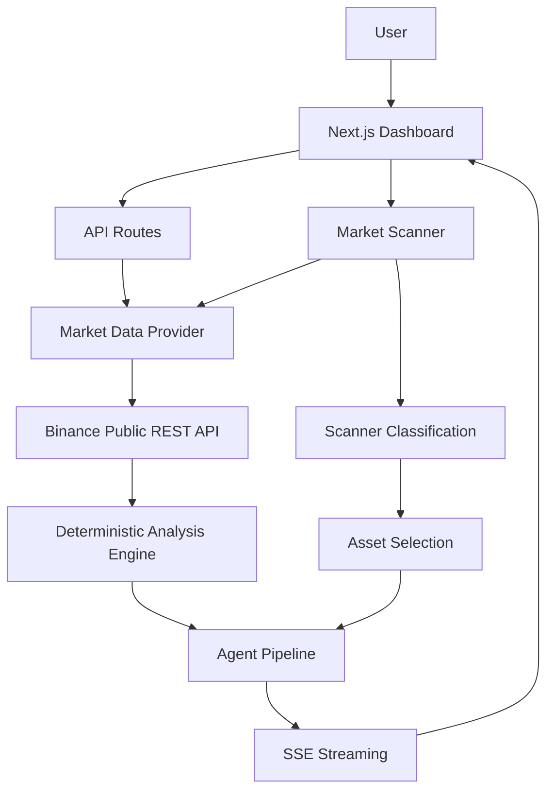
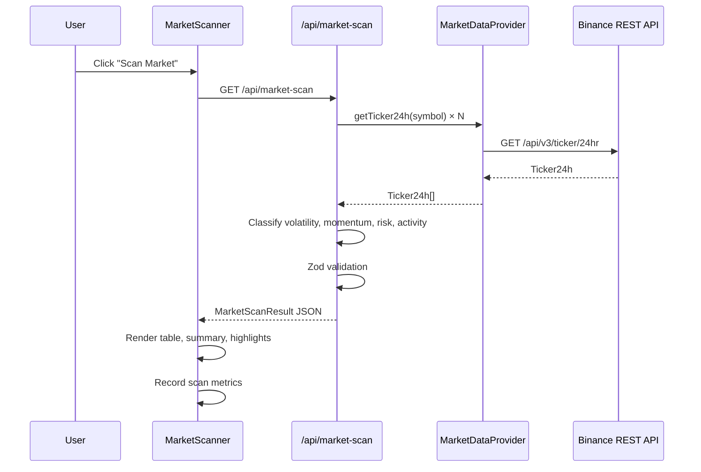
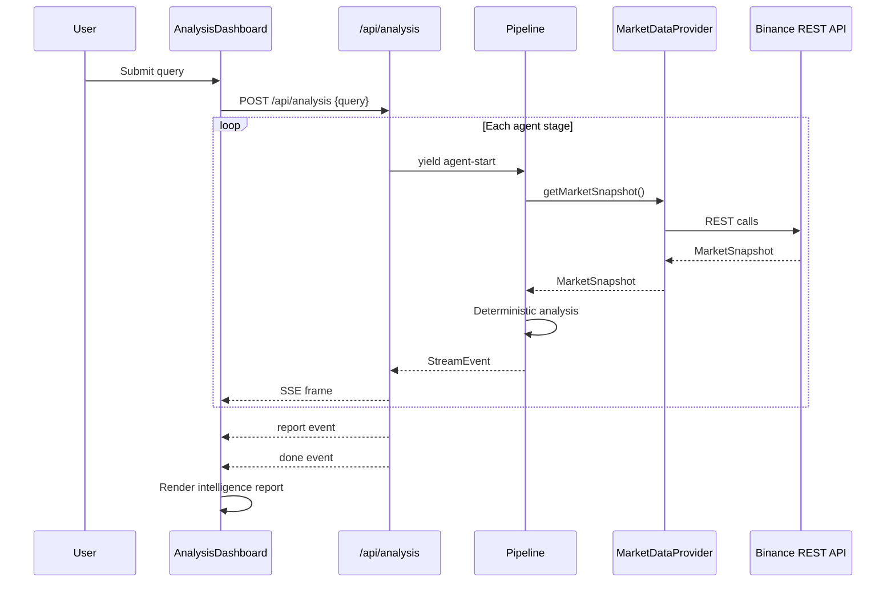

# Architecture

Technical architecture documentation for Binance Sentinel AI.

## System Overview

Binance Sentinel AI is a Next.js 16 application with a deterministic analysis
engine, multi-agent pipeline, and live market scanner. It uses public Binance
market data and requires no authentication for core functionality.



## Frontend Architecture

### Technology Stack

- **Framework**: Next.js 16 (App Router, Turbopack)
- **UI**: React 19, Tailwind CSS v4
- **Fonts**: Geist Sans + Geist Mono
- **Validation**: Zod v4
- **Streaming**: Native SSE via fetch ReadableStream

### Component Hierarchy

```
RootLayout
  └── DashboardLayout (client)
        ├── Header (status badge)
        ├── Sidebar (desktop) / MobileNav (mobile)
        └── Main Content Area
              ├── OverviewPanel
              ├── AnalysisDashboard
              │     ├── QueryInput
              │     ├── ExampleQueries
              │     ├── WorkflowVisualizer
              │     ├── ComparisonView
              │     │     ├── MarketSummary
              │     │     ├── ScoreCard × 2
              │     │     ├── RiskBreakdown
              │     │     └── IntelligencePanel
              │     └── DataSourceStatus (inline)
              ├── MarketScanner
              │     ├── ScannerSummary (4 cards)
              │     ├── ScannerTable (clickable rows)
              │     └── ScannerHighlights (4 sections)
              ├── EvaluationPanel
              ├── DataSourceStatus
              └── WorkflowVisualizer
```

### View Navigation

| ViewId | Component | Description |
|---|---|---|
| `overview` | `OverviewPanel` | Pipeline explanation |
| `analyze` | `AnalysisDashboard` | Query input + full analysis |
| `scanner` | `MarketScanner` + evaluation | Live market scan |
| `workflow` | `WorkflowVisualizer` | Agent pipeline progress |

### Cross-View Navigation

The scanner can trigger deep analysis:
1. User clicks "Analyze" on a scanner table row
2. `buildAnalysisQuery(symbol)` converts e.g. `BTCUSDT` → `"Analyze BTC market risk and conditions"`
3. DashboardLayout switches to `analyze` view with pre-populated query
4. Analysis starts automatically
5. A "Back to Scanner" button and "Source: Live Market Scan" badge appear

## API Architecture

### Endpoints

| Method | Path | Purpose |
|---|---|---|
| `POST` | `/api/analysis` | SSE-streamed multi-agent analysis |
| `GET` | `/api/market-scan` | Live market scanner results |
| `GET` | `/api/mcp/verify` | MCP connectivity check |
| `GET` | `/api/mcp/discovery` | OAuth discovery diagnostics |
| `GET` | `/api/auth/authorize` | Initiate OAuth PKCE flow |
| `GET` | `/api/auth/callback` | OAuth callback handler |
| `GET` | `/api/auth/status` | OAuth readiness status |
| `GET` | `/.well-known/oauth-client-metadata.json` | SEP-991 metadata |

### Data Flow: Scanner



### Data Flow: Deep Analysis



## Market Scanner Flow

### Universe

The scanner operates on the **Sentinel Market Universe** — a curated list of
10 highly liquid USDT pairs:

BTCUSDT, ETHUSDT, SOLUSDT, BNBUSDT, XRPUSDT, ADAUSDT, DOGEUSDT, AVAXUSDT,
LINKUSDT, SUIUSDT

### Classification Formulas

#### Volatility (24h range-based)

```
value = ((highPrice − lowPrice) / lastPrice) × 100

Bands:
  < 2%        → Low
  2% – 5%     → Moderate
  5% – 10%    → High
  ≥ 10%       → Extreme
```

#### Momentum (24h directional)

```
Uses ticker.priceChangePercent

  ≥ +2%  → bullish
  ≤ -2%  → bearish
  else   → neutral
```

#### Risk (lightweight ticker heuristic)

```
volatilitySignal = min(1, rangePct / 0.15)
momentumSignal   = min(1, abs(changePct) / 0.1)
activitySignal   = min(1, max(0, 1 − quoteVolume / 2B))

score = 0.45 × volatilitySignal + 0.3 × momentumSignal + 0.25 × activitySignal
score = round(score × 100, 2)

Bands: 0–24 Low, 25–49 Moderate, 50–74 High, 75–100 Very High
```

#### Activity (relative to universe)

```
ratio = quoteVolume / universeAverageVolume

  ≥ 1.5x  → Very High
  ≥ 0.8x  → High
  ≥ 0.4x  → Moderate
  else    → Low
```

## Deep Analysis Flow

When a user selects an asset from the scanner:

1. `stripQuoteSuffix("BTCUSDT")` → `"BTC"`
2. `buildAnalysisQuery("BTCUSDT")` → `"Analyze BTC market risk and conditions"`
3. DashboardLayout switches to `analyze` view
4. Query is auto-populated in QueryInput
5. `stream.analyze(query)` starts the full 5-stage pipeline
6. Results are displayed via ComparisonView

The deep analysis uses the full deterministic engine:

```
MarketSnapshot
  → analyzeTrend(klines)        // direction, slope, clarity, strength
  → analyzeVolatility(klines)   // dailyStd, annualized, ATR%, level
  → analyzeDrawdown(klines)     // maxDrawdown, currentDrawdown, risk
  → analyzeLiquidity(ticker)    // activity level, quoteVolume
  → computeRisk(...)            // weighted factor composition → score
  → computeReadiness(...)       // weighted factor composition → score
```

## SSE Workflow

The analysis API streams Server-Sent Events:

```
event: agent-start     {"agent": "intent"}
event: agent-complete  {"agent": "intent", "durationMs": 12}
event: agent-start     {"agent": "market"}
event: agent-complete  {"agent": "market", "durationMs": 340}
event: agent-start     {"agent": "risk"}
event: agent-complete  {"agent": "risk", "durationMs": 89}
event: agent-start     {"agent": "research"}
event: agent-complete  {"agent": "research", "durationMs": 95}
event: agent-start     {"agent": "report"}
event: agent-complete  {"agent": "report", "durationMs": 110}
event: report          {"report": {...}}
event: done            {"success": true}
```

The client hook `useAnalysisStream` parses these frames and updates React
state progressively.

## Evaluation Metrics

Tracked at runtime via `metricsTracker` singleton:

| Metric | Source | Formula |
|---|---|---|
| Scan Latency | `performance.now()` | End − start of fetch |
| Analysis Latency | `performance.now()` | End − start of pipeline |
| Scan Success Rate | Scanner response | `(requested − failures) / requested × 100` |
| Partial Failure Rate | Scanner response | `failures / requested × 100` |
| Data Freshness | `scannedAt` timestamp | < 5m Fresh, < 30m Recent, else Stale |
| Pipeline Status | `useAnalysisStream.status` | Complete / Failed / Partial / Idle |

## Failure Handling

### Scanner

- Each symbol is fetched via `Promise.allSettled()`
- Failed symbols are collected in `failures[]` with structured error info
- Successful assets are still returned and classified
- The scanner does not crash on partial failures
- Internal stack traces are never exposed

### Analysis

- Agent pipeline errors emit `agent-error` SSE events
- The stream closes cleanly after error
- The client displays the error in a styled error card

## Security Model

- No private API keys required for core functionality
- All market data from public Binance REST endpoints
- No trading permissions, withdrawals, or account access
- LLM API keys (if configured) are server-side only
- OAuth tokens (if implemented) remain server-side
- No secrets in frontend code or API responses

## Binance Agent OS / MCP Status

**Current state**: Not active in the analysis or scanner pipeline.

**Infrastructure explored**:
- OAuth discovery using Protected Resource Metadata (PRM)
- Authorization Server metadata discovery
- SEP-991 compliant OAuth client metadata
- MCP Streamable HTTP transport verification

**Reason for not active**: The Binance MCP endpoint requires OAuth
authorization. Integration will proceed when the authorization flow is
completed and confirmed working.

**Architecture is modular**: The `MarketDataProvider` adapter pattern
allows swapping in an MCP-backed provider without changing the analysis
engine or agent pipeline.
