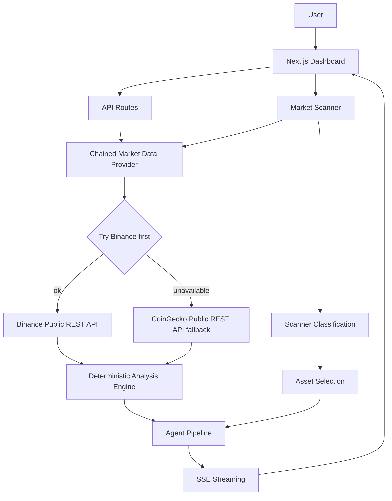
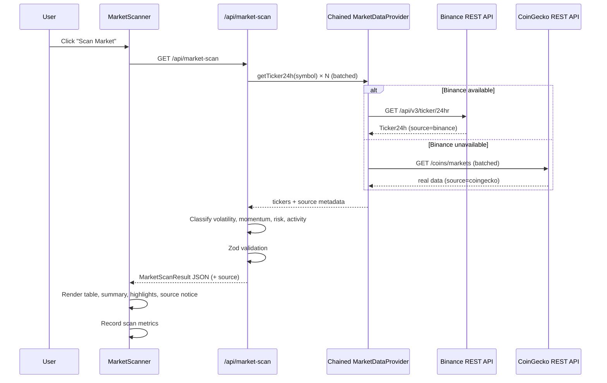
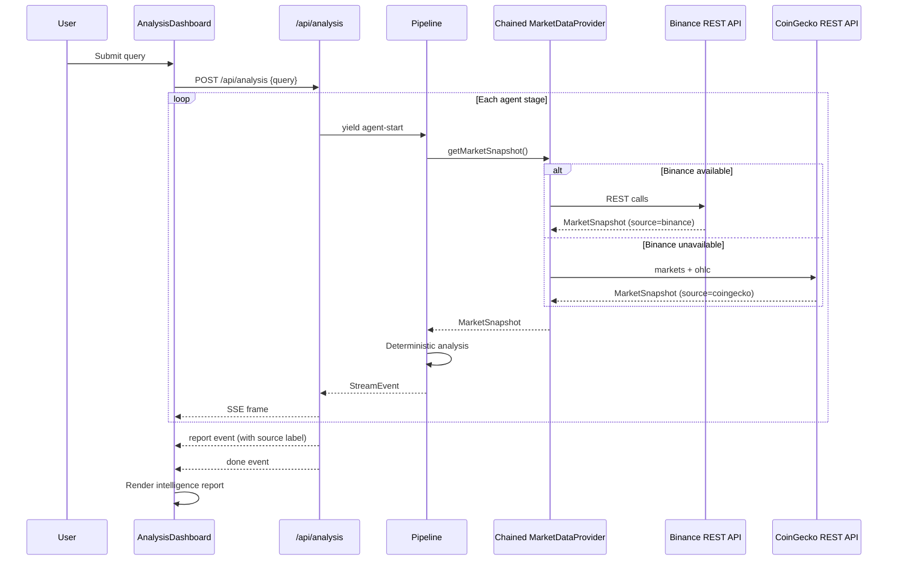

# Architecture

Technical architecture documentation for Binance Sentinel AI.

## System Overview

Binance Sentinel AI is a Next.js 16 application with a deterministic analysis
engine, multi-agent pipeline, and live market scanner. It uses live public
market data with a primary Binance provider and a verified CoinGecko fallback,
and requires no authentication for core functionality.



## Active vs Prepared Capabilities

### ACTIVE NOW

- **Binance Public REST API** — primary market data source (no auth)
- **CoinGecko Public REST API** — verified real fallback (no auth), used
  automatically when Binance is unreachable (e.g. restricted deployment envs)
- **Market Scanner** — live multi-asset classification
- **Analysis pipeline** — deterministic engine + 5-stage agent workflow
- **SSE streaming** — real-time agent progress
- **Provider chain with honest source metadata** — every response and UI labels
  the actual provider used

### PREPARED BUT NOT ACTIVE

- **Binance MCP** — connectivity-layer, OAuth discovery, and client/provider
  code exist, but MCP is **not** wired into the scanner or analysis pipeline
- **OAuth token exchange** — authorization code + PKCE infrastructure exists,
  but a completed, verified end-to-end authorization flow is not in place
- **MCP-backed MarketDataProvider** — not registered / not used; the chain
  currently uses Binance REST + CoinGecko REST only

## Frontend Architecture

### Technology Stack

- **Framework**: Next.js 16 (App Router, Turbopack)
- **UI**: React 19, Tailwind CSS v4
- **Fonts**: Geist Sans + Geist Mono
- **Validation**: Zod v4
- **Streaming**: Native SSE via fetch ReadableStream

### Component Hierarchy

```
RootLayout
  └── DashboardLayout (client)
        ├── Header (status badge)
        ├── Sidebar (desktop) / MobileNav (mobile)
        └── Main Content Area
              ├── OverviewPanel
              ├── AnalysisDashboard
              │     ├── QueryInput
              │     ├── ExampleQueries
              │     ├── WorkflowVisualizer
              │     ├── ComparisonView
              │     │     ├── MarketSummary
              │     │     ├── ScoreCard × 2
              │     │     ├── RiskBreakdown
              │     │     └── IntelligencePanel
              │     └── DataSourceStatus (inline)
              ├── MarketScanner
              │     ├── ScannerSummary (4 cards)
              │     ├── ScannerTable (clickable rows)
              │     └── ScannerHighlights (4 sections)
              ├── EvaluationPanel
              ├── DataSourceStatus
              └── WorkflowVisualizer
```

### View Navigation

| ViewId | Component | Description |
|---|---|---|
| `overview` | `OverviewPanel` | Pipeline explanation |
| `analyze` | `AnalysisDashboard` | Query input + full analysis |
| `scanner` | `MarketScanner` + evaluation | Live market scan |
| `workflow` | `WorkflowVisualizer` | Agent pipeline progress |

### Cross-View Navigation

The scanner can trigger deep analysis:
1. User clicks "Analyze" on a scanner table row
2. `buildAnalysisQuery(symbol)` converts e.g. `BTCUSDT` → `"Analyze BTC market risk and conditions"`
3. DashboardLayout switches to `analyze` view with pre-populated query
4. Analysis starts automatically
5. A "Back to Scanner" button and "Source: Live Market Scan" badge appear

## API Architecture

### Endpoints

| Method | Path | Purpose |
|---|---|---|
| `POST` | `/api/analysis` | SSE-streamed multi-agent analysis |
| `GET` | `/api/market-scan` | Live market scanner results |
| `GET` | `/api/mcp/verify` | MCP connectivity check |
| `GET` | `/api/mcp/discovery` | OAuth discovery diagnostics |
| `GET` | `/api/auth/authorize` | Initiate OAuth PKCE flow |
| `GET` | `/api/auth/callback` | OAuth callback handler |
| `GET` | `/api/auth/status` | OAuth readiness status |
| `GET` | `/.well-known/oauth-client-metadata.json` | SEP-991 metadata |

### Data Flow: Scanner



### Data Flow: Deep Analysis



## Market Scanner Flow

### Universe

The scanner operates on the **Sentinel Market Universe** — a curated list of
10 highly liquid USDT pairs:

BTCUSDT, ETHUSDT, SOLUSDT, BNBUSDT, XRPUSDT, ADAUSDT, DOGEUSDT, AVAXUSDT,
LINKUSDT, SUIUSDT

### Classification Formulas

#### Volatility (24h range-based)

```
value = ((highPrice − lowPrice) / lastPrice) × 100

Bands:
  < 2%        → Low
  2% – 5%     → Moderate
  5% – 10%    → High
  ≥ 10%       → Extreme
```

#### Momentum (24h directional)

```
Uses ticker.priceChangePercent

  ≥ +2%  → bullish
  ≤ -2%  → bearish
  else   → neutral
```

#### Risk (lightweight ticker heuristic)

```
volatilitySignal = min(1, rangePct / 0.15)
momentumSignal   = min(1, abs(changePct) / 0.1)
activitySignal   = min(1, max(0, 1 − quoteVolume / 2B))

score = 0.45 × volatilitySignal + 0.3 × momentumSignal + 0.25 × activitySignal
score = round(score × 100, 2)

Bands: 0–24 Low, 25–49 Moderate, 50–74 High, 75–100 Very High
```

#### Activity (relative to universe)

```
ratio = quoteVolume / universeAverageVolume

  ≥ 1.5x  → Very High
  ≥ 0.8x  → High
  ≥ 0.4x  → Moderate
  else    → Low
```

## Deep Analysis Flow

When a user selects an asset from the scanner:

1. `stripQuoteSuffix("BTCUSDT")` → `"BTC"`
2. `buildAnalysisQuery("BTCUSDT")` → `"Analyze BTC market risk and conditions"`
3. DashboardLayout switches to `analyze` view
4. Query is auto-populated in QueryInput
5. `stream.analyze(query)` starts the full 5-stage pipeline
6. Results are displayed via ComparisonView

The deep analysis uses the full deterministic engine:

```
MarketSnapshot
  → analyzeTrend(klines)        // direction, slope, clarity, strength
  → analyzeVolatility(klines)   // dailyStd, annualized, ATR%, level
  → analyzeDrawdown(klines)     // maxDrawdown, currentDrawdown, risk
  → analyzeLiquidity(ticker)    // activity level, quoteVolume
  → computeRisk(...)            // weighted factor composition → score
  → computeReadiness(...)       // weighted factor composition → score
```

## SSE Workflow

The analysis API streams Server-Sent Events:

```
event: agent-start     {"agent": "intent"}
event: agent-complete  {"agent": "intent", "durationMs": 12}
event: agent-start     {"agent": "market"}
event: agent-complete  {"agent": "market", "durationMs": 340}
event: agent-start     {"agent": "risk"}
event: agent-complete  {"agent": "risk", "durationMs": 89}
event: agent-start     {"agent": "research"}
event: agent-complete  {"agent": "research", "durationMs": 95}
event: agent-start     {"agent": "report"}
event: agent-complete  {"agent": "report", "durationMs": 110}
event: report          {"report": {...}}
event: done            {"success": true}
```

The client hook `useAnalysisStream` parses these frames and updates React
state progressively.

## Evaluation Metrics

Tracked at runtime via `metricsTracker` singleton:

| Metric | Source | Formula |
|---|---|---|
| Scan Latency | `performance.now()` | End − start of fetch |
| Analysis Latency | `performance.now()` | End − start of pipeline |
| Scan Success Rate | Scanner response | `(requested − failures) / requested × 100` |
| Partial Failure Rate | Scanner response | `failures / requested × 100` |
| Data Freshness | `scannedAt` timestamp | < 5m Fresh, < 30m Recent, else Stale |
| Pipeline Status | `useAnalysisStream.status` | Complete / Failed / Partial / Idle |

## Failure Handling

### Scanner

- Each symbol is fetched via `Promise.allSettled()`
- Failed symbols are collected in `failures[]` with structured error info
- Successful assets are still returned and classified
- The scanner does not crash on partial failures
- Internal stack traces are never exposed

### Analysis

- Agent pipeline errors emit `agent-error` SSE events
- The stream closes cleanly after error
- The client displays the error in a styled error card

## Market Data Provider Chain

The `MarketDataProvider` capability contract (`lib/binance-agent-os/types.ts`)
is implemented by:

| Provider | File | Status |
|---|---|---|
| `BinancePublicMarketDataProvider` | `binance-agent-os/market-data.ts` | **Primary**, active |
| `CoinGeckoMarketDataProvider` | `binance-agent-os/coingecko.ts` | **Fallback**, active |
| `ChainedMarketDataProvider` | `binance-agent-os/chain.ts` | Compose primary + fallback |
| `BinanceCliMarketDataProvider` | `binance-agent-os/cli.ts` | **Optional**, gated (public `binance-cli` commands, no credentials), not in the default chain |
| `BinanceMcpMarketDataProvider` | `binance-agent-os/mcp.ts` | **Prepared**, gated (requires a real token), not in the default chain |

The adapter (`adapter.ts`) returns a `ChainedMarketDataProvider` whose
`runChain` tries Binance first and, on any Binance failure (network, restricted
location, availability), fails over to CoinGecko. Each successful call is
served by exactly one provider and is labeled honestly — fallback data is never
claimed to be Binance data.

### Binance CLI Integration (optional, local-only)

The `BinanceCliMarketDataProvider` invokes the **official** `binance-cli`
binary (from the installed Binance skill, `.agents/skills/binance`) as a
subprocess, restricted to public SPOT market-data commands: `spot klines`,
`spot ticker24hr`, `spot exchange-info`. No credentials, no `--signed`
commands, no account/trading functionality. Symbols must match
`/^[A-Z][A-Z0-9]{1,29}$/`, intervals come from a fixed whitelist, and args are
quoted and executed through a Windows-safe `cmd.exe` shim with stdin closed and
hard timeout.

It is **disabled by default** (`BINANCE_ENABLE_CLI_PROVIDER=1` + explicit
`BINANCE_MARKET_DATA_PROVIDER=binance-cli-public-api` selection). Because it
depends on a local binary it is for **local/self-hosted** use; Vercel/serverless
deployments keep the default Binance → CoinGecko chain.

### Data Source Transparency

- The scanner response includes `source` metadata:
  `{ provider, providerLabel, fallbackUsed, fetchedAt }` plus a per-asset
  `source` field.
- The analysis report's `marketData` carries `source`, `sourceLabel`, and
  `fallbackUsed`.
- The UI shows the active source on the scanner ("Market Data Source" notice)
  and on each analysis asset summary, with a clear note when fallback was used.

### CoinGecko Fallback Notes

- No API key required for the endpoints used.
- Ticker fields: price, 24h change, high, low, USD volume (base volume estimated
  as quoteVolume ÷ price; trade count not exposed).
- OHLC bars: real price bars from `/coins/{id}/ohlc`; volume is not returned by
  that endpoint (the deterministic trend/volatility/drawdown modules use price
  bars only, so analysis remains valid).
- Rate limiting: the free tier (~10-30 req/min) is handled by (a) batching the
  whole scanner universe into a single `/coins/markets` request and (b) retrying
  transient `429`/`5xx` responses with backoff. Under extreme repeated load some
  symbols may still fail and are reported as partial failures rather than
  fabricated.

## Security Model

- No private API keys required for core functionality
- All market data from public Binance REST / CoinGecko REST endpoints
- No trading permissions, withdrawals, or account access
- LLM API keys (if configured) are server-side only
- OAuth tokens (if implemented) remain server-side
- No secrets in frontend code or API responses

## Binance Agent OS / MCP Status

**Current state**: MCP is **NOT active** in the analysis or scanner pipeline.

### MCP Integration Status (Phase 10 audit)

| Aspect | Status |
|---|---|
| **Infrastructure** | Prepared, not active |
| **Authentication** | OAuth discovery + PKCE infrastructure implemented; no completed, verified end-to-end authorization |
| **Pipeline integration** | Not wired into scanner or analysis |
| **Current limitation** | Binance MCP endpoint requires OAuth authorization; integration proceeds only when an authorized flow is confirmed working |

### What is implemented (real, server-side)

- **Connectivity verification** (`lib/binance-mcp/client.ts`): performs a REAL
  MCP initialize/`listTools` handshake against the official endpoint
  `https://agent.binance.com/mcp/agentic`. Never mocks tools or versions.
- **OAuth discovery** (`lib/binance-mcp/oauth-discovery.ts`): fetches and
  validates live Protected Resource Metadata and Authorization Server Metadata
  against the official `@modelcontextprotocol/sdk` schemas.
- **OAuth client provider + session store** (`oauth-provider.ts`,
  `oauth-session.ts`): implements the SDK's `OAuthClientProvider` and holds
  state/verifier/tokens in-memory server-side only.
- **Diagnostic routes**: `GET /api/mcp/verify`, `GET /api/mcp/discovery`,
  `GET /api/auth/status`, `GET /api/auth/authorize`, `GET /api/auth/callback`.

### Why MCP is not active

A real authorized connection attempt to the official Binance Agent MCP endpoint
was rejected by Binance with **"The AI Agent you are using is not currently
supported."** That is an external supported-agent restriction on Binance's side;
we do not bypass it. Until a supported-agent authorization flow is available,
MCP is intentionally left out of the live data pipeline. The live pipeline uses
Binance REST (primary) + CoinGecko REST (fallback). The pipeline activates the
MCP provider only when `BINANCE_ENABLE_MCP_PROVIDER=1`, a real
`BINANCE_MCP_ACCESS_TOKEN`, and explicit selection are all present — and never
before a real `listTools()` handshake succeeds.

**Architecture is modular**: The `MarketDataProvider` adapter pattern allows
swapping in an MCP-backed provider without changing the analysis engine or
agent pipeline.
